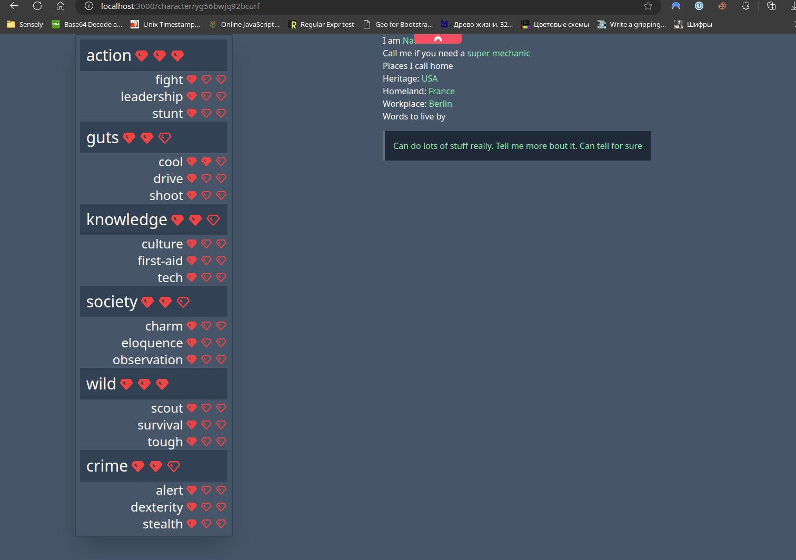
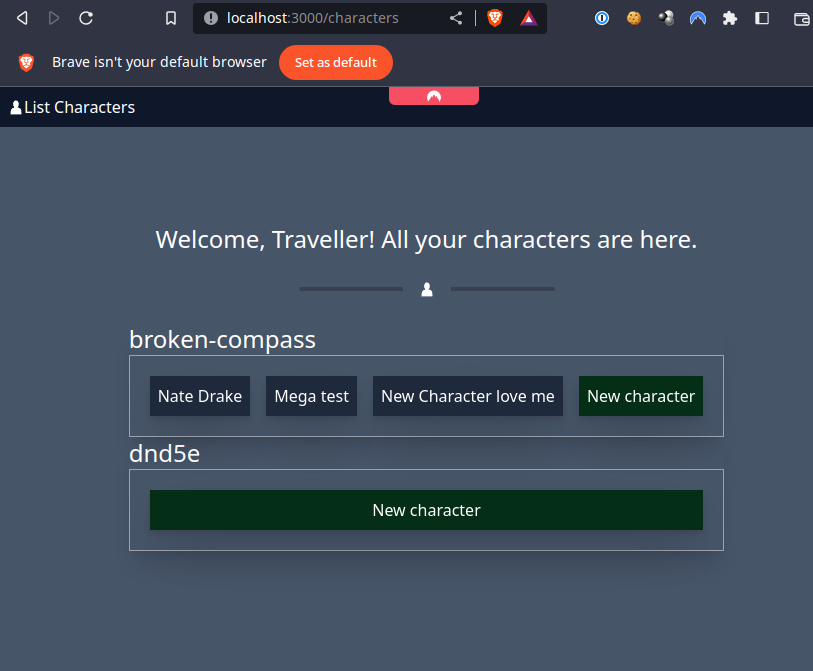

# WIP Fable Frame prototype

A WIP project to create an application to store Character Sheets from different TTRPGs in one place.
- Mobile Layout
- External modules (TTRPG systems, themes, content, etc.)
- Self-Hosted Free and OpenSource
- Master/Player roles. The Master can create a Campaign (game) and assign Characters there.
- Note keeping? If so - use MD.

# Stack Details:
- [NextJS 13](https://nextjs.org/) as Backend and Frontend
- [Pocketbase](https://pocketbase.io/) as DB
- Localhost as a hosting provider
- Typescript as himself

# Starting point
- [Broken Compass TTRPG](https://twolittlemice.net/brokencompass)

# Dev Notes
- To access Pocketbase DB from local start it with `./pocketbase serve --http="MACHINELOCALIP:8090"` and then change the db.tsx to reflect the IP change.

# Current Progress

